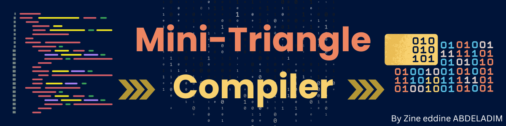

# Mini-Triangle java Compiler


# 1. Grammaire originale Mini-Triangle en EBNF

```ebnf
Program             ::= single-Command

Command             ::= single-Command
                      | Command ";" single-Command

single-Command      ::= V-name ":=" Expression
                      | Identifier "(" Expression ")"
                      | "if" Expression "then" single-Command "else" single-Command
                      | "while" Expression "do" single-Command
                      | "let" Declaration "in" single-Command
                      | "begin" Command "end"

Expression          ::= primary-Expression
                      | Expression Operator primary-Expression

primary-Expression  ::= Integer-Literal
                      | V-name
                      | Operator primary-Expression
                      | "(" Expression ")"

Declaration         ::= single-Declaration
                      | Declaration ";" single-Declaration

single-Declaration  ::= "const" Identifier "~" Expression
                      | "var" Identifier ":" Type-denoter

Type-denoter        ::= Identifier
V-name              ::= Identifier

```

---

# 2. Transformations de la grammaire

Pour rendre la grammaire LL(1) et utilisable en descente récursive, on applique :

- **Factorisation à gauche**
- **Élimination de la récursivité à gauche (indirecte et immediat)**
- **Substitution**

## 2.1 Substitution

### `single-Command`

**Original**:

```ebnf
single-Command ::= V-name ":=" Expression
                 | Identifier "(" Expression ")"
                 | if ...
                 | while ...
                 | let ...
                 | begin ...
                 
V-name         ::= Identifier
```

**Substitution** :

```ebnf
single-Command ::= identifier ":=" Expression
                 | Identifier "(" Expression ")"
                 | if ...
                 | while ...
                 | let ...
                 | begin ...
                 
V-name         ::= Identifier
```

## 2.2 Factorisation a gauche

### `single-Command`

**Original**:

```ebnf
single-Command ::= identifier ":=" Expression
                 | Identifier "(" Expression ")"
                 | if ...
                 | while ...
                 | let ...
                 | begin ...
                 
V-name         ::= Identifier
```

Deux alternatives démarrent par `Identifier`

**Factorisation a gauche**:

```ebnf
single-Command ::= Identifier (":=" Expression | "(" Expression ")")
                 | "if" Expression "then" single-Command "else" single-Command
                 | "while" Expression "do" single-Command
                 | "let" Declaration "in" single-Command
                 | "begin" Command "end"
```

## 2.3 Elimination de la recursivite a gauche :

listé les non‑terminaux dans l’ordre :

A₁ = Program
A₂ = Command
A₃ = single-Command
A₄ = Declaration
A₅ = single-Declaration
A₆ = Expression
A₇ = primary-Expression

---

Pour chaque Ai, on parcourt j=1…i−1 pour voir si une règle de Ai commence par Aj.

- **i=2 (Command)** : on vérifie j=1 (Program) → aucune règle `Command → Program …`.
- **i=3 (single-Command)** : on vérifie j=1 (Program), j=2 (Command) → aucune règle ne commence par ces non‑terminaux.
- …
- **i=6 (Expression)** : on vérifie j=1…5 → aucune règle ne commence par un autre non‑terminal que `Expression` lui‑même.

À chaque étape, comme on ne trouvait **jamais** de `Ai → Aj γ`, on n’a fait **aucune substitution**.

---

Les seuls non‑terminaux qui présentaient de la récursivité à gauche immédiat étaient :

- `Command ::= Command ";" single-Command | single-Command`
- `Declaration ::= Declaration ";" single-Declaration | single-Declaration`
- `Expression ::= Expression Operator primary-Expression | primary-Expression`

Pour chacun, on a appliqué la **méthode d’élimination immédiate** (page 20) :

> A → A α | β
> 
> 
> into
> 
> **A → β A′**
> 
> **A′ → α A′ | ε**
> 

### `Command`

**Original**:

```ebnf
Command ::= single-Command
          | Command ";" single-Command

```

**Transformée**:

```ebnf
Command  ::= single-Command Command'
Command' ::= ";" single-Command Command'
           | ε

```

### `Declaration`

**Original**:

```ebnf
Declaration ::= single-Declaration
              | Declaration ";" single-Declaration

```

**Transformée**:

```ebnf
Declaration  ::= single-Declaration Declaration'
Declaration' ::= ";" single-Declaration Declaration'
               | ε

```

### `Expression`

**Original**:

```ebnf
Expression ::= primary-Expression
             | Expression Operator primary-Expression

```

**Transformée**:

```ebnf
Expression  ::= primary-Expression Expr'
Expr'       ::= Operator primary-Expression Expr'  
              | ε
```

# 1. Grammaire Transformé Mini-Triangle en EBNF

```ebnf
Program             ::= single-Command

Command             ::= single-Command Command'
Command'            ::= ";" single-Command Command'
	                    | ε

single-Command      ::= Identifier (":=" Expression | "(" Expression ")")
                      | "if" Expression "then" single-Command "else" single-Command
                      | "while" Expression "do" single-Command
                      | "let" Declaration "in" single-Command
                      | "begin" Command "end"

Expression         ::= primary-Expression Expr'
Expr'              ::= Operator primary-Expression Expr'  
                     | ε

primary-Expression  ::= Integer-Literal
                      | V-name
                      | Operator primary-Expression
                      | "(" Expression ")"

Declaration         ::= single-Declaration Declaration'
Declaration'        ::= ";" single-Declaration Declaration'
                      | ε

single-Declaration  ::= "const" Identifier "~" Expression
                      | "var" Identifier ":" Type-denoter

Type-denoter        ::= Identifier
V-name              ::= Identifier

```
